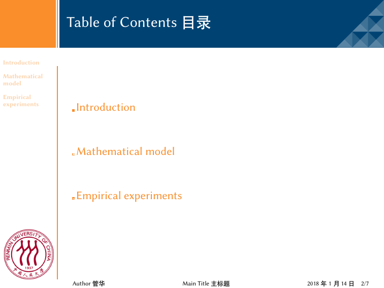
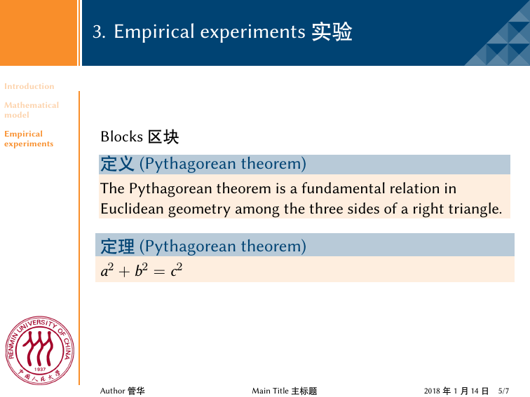
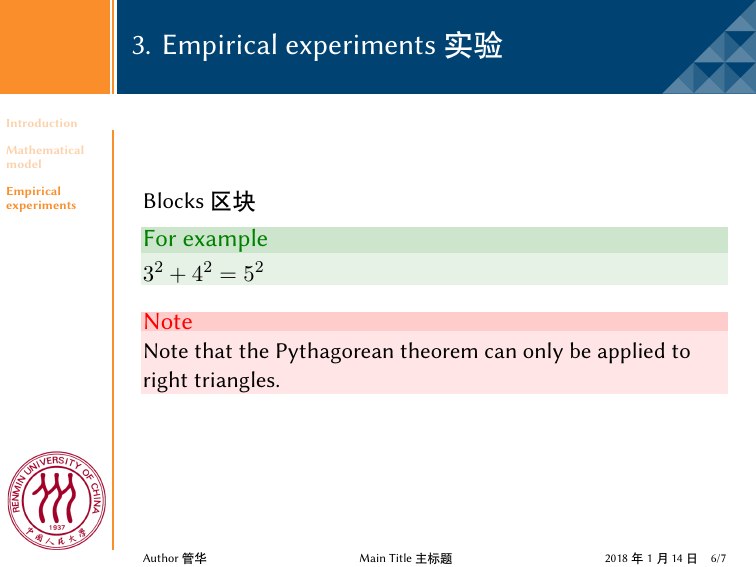
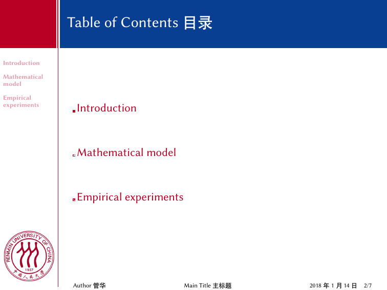
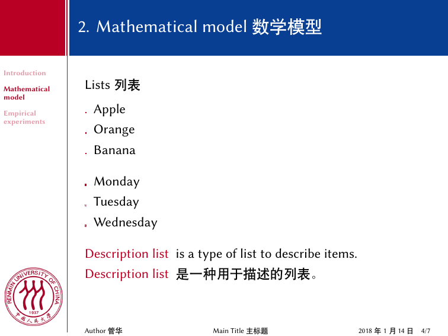
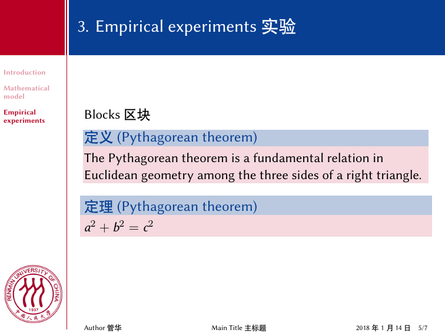

# paper-presentation

This is my paper presentaion in [RUC](http://www.ruc.edu.cn) [BDAI](http://bdai.ruc.edu.cn) which support English and Chinese.

## The beamer theme is JUB

## The beamer theme is ALUF

